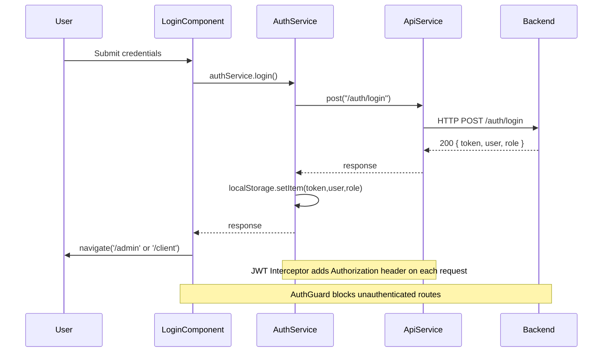
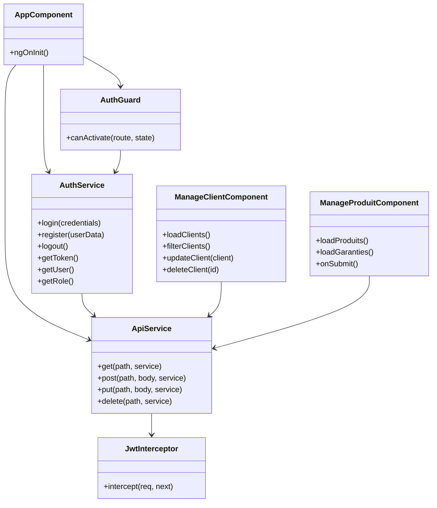
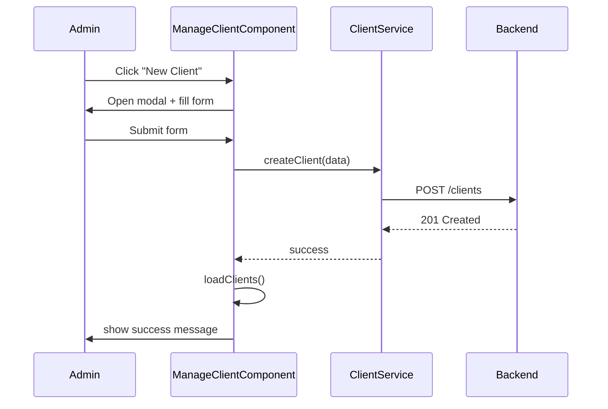

# Diagrams for Frontend Project

This document contains a set of diagrams (Mermaid) that describe the main structure and flows of this Angular (standalone) application.

> 💡 To render these diagrams, use a Markdown viewer that supports Mermaid (VS Code Markdown Preview, GitHub, etc.).

---

## 1) High-Level Routing & Layout

```mermaid
flowchart TD
  subgraph App[App]
    A[AppComponent]
    A -->|bootstrap| B[RouterOutlet]
  end

  B -->|"/auth"| AuthModule[Auth Module]
  B -->|"/admin" (authGuard)| AdminModule[Admin Module]
  B -->|"/client" (authGuard)| ClientModule[Client Module]

  subgraph Auth
    AuthModule --> Login[LoginComponent]
    AuthModule --> Register[RegisterComponent]
    Login -->|redirect| AdminModule
    Login -->|redirect| ClientModule
  end

  subgraph Admin
    AdminModule --> AdminLayout[AdminLayoutComponent]
    AdminLayout -->|"/dashboard"| Dashboard[DashboardComponent]
    AdminLayout -->|"/produits"| ManageProduit[ManageProduitComponent]
    AdminLayout -->|"/packs"| ManagePack[ManagePackComponent]
    AdminLayout -->|"/garanties"| ManageGarantie[ManageGarantieComponent]
    AdminLayout -->|"/clients"| ManageClient[ManageClientComponent]
    AdminLayout -->|"/chat"| AdminChat[AdminChatComponent]
  end

  subgraph Client
    ClientModule --> ClientDashboard[DashboardComponent]
    ClientModule --> Chatbot[ChatbotComponent]
    ClientModule --> Subscription[SubscriptionComponent]
  end

  style AuthModule fill:#f0f9ff,stroke:#007acc
  style AdminModule fill:#e8f9e9,stroke:#2a9d8f
  style ClientModule fill:#fff3e0,stroke:#f4a261
```

---

## 2) Authentication & HTTP Flow



---

## 3) Core Services & Interceptors

```mermaid
flowchart LR
  subgraph Browser
    UI[UI Components] -->|HttpClient| HttpClient[Angular HttpClient]
  end

  subgraph Core[Core]
    HttpClient --> JwtInt[ jwtInterceptor ]
    JwtInt --> ApiService[ApiService]
    ApiService -->|get/post/put/delete| Backend[Backend API]
    AuthService -->|login/register/logout| LocalStorage[localStorage]
    AuthGuard -->|check token| LocalStorage
  end

  AuthService --- ApiService
  AuthGuard --- AuthService

  note right of LocalStorage: Stores token, user, role
```

---

## 4) Folder / Module Structure (Quick View)

```text
src/app/
  app.component.ts (standalone)
  app.config.ts (provideRouter, provideHttpClient)
  app.routes.ts (root routes)

  auth/
    auth-routing.module.ts
    login/
    register/

  admin/
    admin-routing.module.ts
    layout/
    dashboard/
    manage-client/
    manage-pack/
    manage-produit/
    manage-garantie/
    admin-chat/

  client/
    client-routing.module.ts
    dashboard/
    chatbot/
    subscription/

  core/
    api.service.ts
    auth.service.ts
    auth.guard.ts
    jwt.interceptor.ts
    api-config.ts
```

---

## 5) Class Diagram (Key Components + Services)



---

## 6) Use Case Diagram (Utilisateur / Admin)

```mermaid
usecaseDiagram
  actor User
  actor Admin

  User -- (Login)
  User -- (View Dashboard)
  User -- (Chat with Bot)
  User -- (Manage Subscription)

  Admin -- (Login)
  Admin -- (Manage Clients)
  Admin -- (Manage Products)
  Admin -- (Manage Packs)
  Admin -- (Manage Guarantees)
  Admin -- (View Dashboard)
  Admin -- (Chat with Client)

  (Login) <.. (Manage Clients)
  (Login) <.. (Manage Products)
  (Login) <.. (Manage Packs)
  (Login) <.. (Manage Guarantees)
  (Login) <.. (Chat with Client)
```

---

## 7) Sequence Diagram (Create Client Flow)


